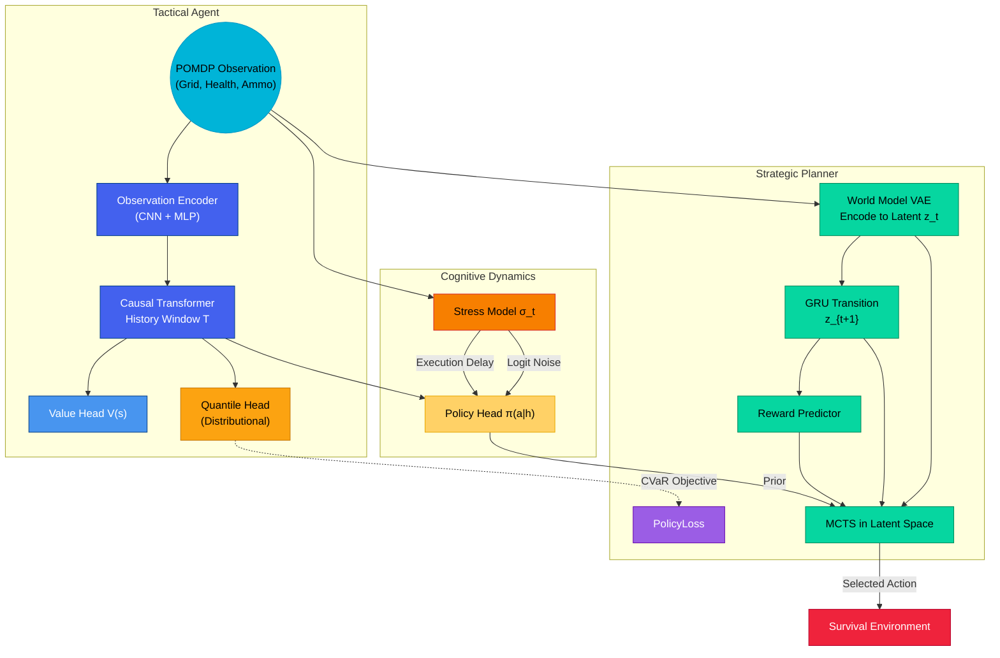
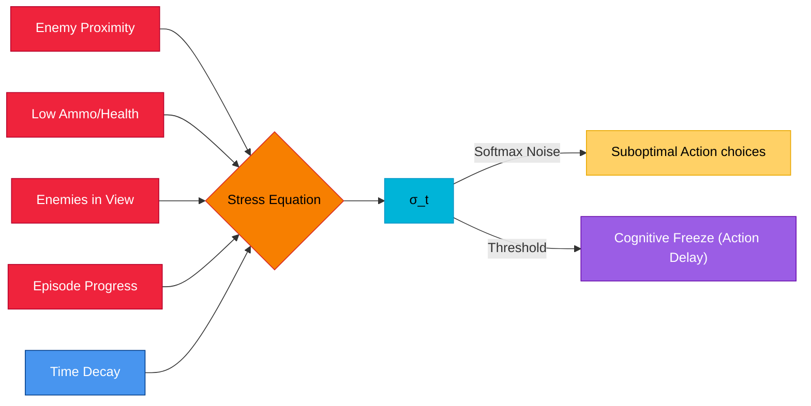

# Wesker AI 🧠⚔️
**Research-grade hierarchical survival optimization AI.**

A modular PyTorch framework combining:
- POMDP gridworld survival environment
- Transformer-based tactical policy
- Distributional RL with CVaR risk-sensitivity
- Stress-driven bounded rationality
- World model (VAE + latent GRU transition)
- MCTS planning in latent space
- **[v2.0.0]** Complex 3D-like multi-floor environments with enemy archetypes
- **[v2.0.0]** Multi-agent scenarios (competitive, cooperative, mixed-team)
- **[v2.0.0]** Human-in-the-Loop guidance with reward shaping

---
#**Features**

### 1. Complex 3D-Like Environment (`complex_environment.py`)
Dropped-in replacement for the base `SurvivalEnv` with richer world state:
- **Multi-floor dungeons** — portals connect floors; depth-channel ray-casting (obs channel 19)
- **Enemy archetypes** — `GRUNT` (fast, weak), `SNIPER` (ranged, accurate), `TANK` (slow, high-HP)
- **Environmental hazards** — fire / acid / radiation zones that deal continuous damage
- **Cover objects** — line-of-sight blockers that affect enemy targeting probability
- **3 ammo types** — standard, heavy, explosive (with blast radius)
- **19 discrete actions** including `CROUCH_TOGGLE`, `USE_HEAVY_AMMO`, `USE_EXPLOSIVE`, `INTERACT`
- **6 scalar features**: health, ammo, stress, has_key, floor, crouch state
- Observation tensor: `(20, obs_size, obs_size)`

```python
from wesker_ai.complex_environment import AdvancedSurvivalEnv, AdvancedEnvConfig
cfg = AdvancedEnvConfig(num_floors=3, num_enemies=6, grid_size=15)
env = AdvancedSurvivalEnv(cfg, seed=42)
obs = env.reset()   # grid=(20,15,15)  scalars=(6,)
```

### 2. Multi-Agent Scenarios (`multi_agent_env.py`)
N-agent shared-world environment for training competitive or cooperative policies:
- **3 modes**: `COMPETITIVE` (zero-sum), `COOPERATIVE` (shared reward), `MIXED` (team-based)
- **Centralized critic support** via `get_global_state()` → flat vector `(8 × grid²,)`
- **Per-agent observations** include ally-presence and enemy-agent channels
- **5 scalar features per agent**: health, ammo, stress, has_key, alive_allies (normalized)

```python
from wesker_ai.multi_agent_env import MultiAgentEnv, MultiAgentConfig, MultiAgentMode
cfg = MultiAgentConfig(num_agents=4, mode=MultiAgentMode.COOPERATIVE)
env = MultiAgentEnv(cfg, seed=0)
obs_n = env.reset()                          # Dict[agent_id, MAObservation]
obs_n, rew_n, done_n, info_n = env.step({0: 2, 1: 5, 2: 1, 3: 7})
global_state = env.get_global_state()        # for centralized critic
```

### 3. Human-in-the-Loop (`human_in_loop.py`)
Wrapper that injects human guidance into any `SurvivalEnv`-like environment:
- **3 guidance modes**: `SUGGEST` (hint only), `OVERRIDE` (force action), `APPROVE` (veto check)
- **5 trigger conditions**: `ALWAYS`, `ON_ENTROPY`, `ON_DANGER`, `ON_REQUEST`, `PERIODIC`
- **Reward shaping**: `r_shaped = r_env + human_feedback + 0.1 × pending_feedback`
- **Feedback buffer** with `.save()` / `.load()` (`.npz`) for offline imitation learning
- **Imitation dataset** extraction from override trajectories

```python
from wesker_ai.human_in_loop import make_hitl_env, GuidanceMode, InterventionTrigger
env = make_hitl_env(
    env=SurvivalEnv(cfg.env),
    guidance_mode=GuidanceMode.SUGGEST,
    trigger=InterventionTrigger.ON_DANGER,
    interactive=False,          # swap True for CLI prompts
)
obs = env.reset()
obs, reward, done, info = env.step(agent_action=3, policy_logits=logits)
```

---

## Architecture Flow



## The Survival Model: A Theoretical Framework

Wesker AI is not just a standard reinforcement learning agent; it is a **survival model**. The agent's primary objective is not merely to maximize cumulative reward, but to **persist in a hostile, partially-observable world**. This is achieved through a synthesis of three core theoretical concepts:

1.  **Bounded Rationality under Stress:** Real-world survival decisions are made under immense cognitive and physiological pressure. The **Stress Model** simulates this by degrading the agent's decision-making capabilities as it encounters threats (enemy proximity) and resource scarcity (low health/ammo). This is a form of *bounded rationality*, where the agent's ability to make optimal choices is limited by its cognitive state. The model manifests this through:
    *   **Logit Noise:** Increased stress adds noise to the agent's policy, making it more likely to choose suboptimal actions.
    *   **Action Delay:** Critical stress levels can cause "cognitive freeze," where the agent's actions are delayed, simulating the effects of panic or information overload.

2.  **Risk-Averse Decision-Making:** Survival is not about achieving the best possible outcome in a single instance, but about avoiding catastrophic failures over the long term. Standard RL agents, which optimize for expected return (E\[R]), are often blind to low-probability, high-impact negative events. Wesker AI addresses this by using a **distributional RL approach with a Conditional Value-at-Risk (CVaR) objective**. Instead of optimizing for the average outcome, the agent is trained to optimize the expected return of the *worst-case scenarios* (e.g., the bottom 25% of outcomes). This makes the agent inherently risk-averse, preferring "safer" strategies that minimize the chance of catastrophic failure, even if they don't offer the highest possible reward.

3.  **Hierarchical Planning and Reacting:** The agent's architecture reflects a two-tiered cognitive process:
    *   **Tactical Agent (Reactive):** The Transformer-based policy network acts as a fast, reactive system that can make immediate, context-aware decisions based on the current situation and recent history.
    *   **Strategic Planner (Deliberative):** The optional **Monte Carlo Tree Search (MCTS) in latent space** provides a slower, more deliberative planning capability. By "imagining" future trajectories in the learned world model, the agent can make more strategic, long-term decisions.

By integrating these three concepts, Wesker AI moves beyond simple reward maximization to create a more robust and realistic model of a survival agent.

---

## Real-World Implications

The concepts and architectures explored in Wesker AI have significant implications for the design of robust, safe, and reliable AI systems in a variety of real-world domains:

*   **Autonomous Vehicles:** Self-driving cars operate in high-stakes environments where catastrophic failures are unacceptable. A risk-averse driving policy, trained with a CVaR objective, could learn to prefer safer, more defensive maneuvers, even if it means slightly longer travel times. The stress model could also be adapted to model system uncertainty or sensor degradation, leading to more cautious behavior in adverse conditions.

*   **Robotics and Industrial Automation:** In industrial settings, robots often work in close proximity to humans. A robot with a "survival" instinct would be more likely to prioritize avoiding collisions and other safety-critical events over maximizing production speed. The hierarchical planning architecture could enable a robot to react quickly to immediate obstacles while still pursuing long-term goals.

*   **Financial Trading and Portfolio Management:** Financial markets are notoriously volatile and unpredictable. An AI-powered trading agent trained with a CVaR objective would be less likely to make high-risk trades that could lead to large losses, even if those trades have a high expected return. The stress model could be used to model market volatility, leading to more conservative trading strategies during periods of high uncertainty.

*   **Cybersecurity:** An AI-powered network defense system could be trained to be risk-averse, prioritizing the prevention of catastrophic security breaches over the detection of every minor anomaly. The system could learn to identify and mitigate high-risk threats, even if it means a higher false positive rate.

By moving beyond simple reward maximization and incorporating concepts like bounded rationality and risk aversion, the research in Wesker AI paves the way for the development of more trustworthy and resilient AI systems that can operate safely and effectively in the complexities of the real world.

---

## Quickstart

```bash
# Install dependencies
pip install -r requirements.txt

# Full training run
py wesker_ai/main.py

# Smoke test — validates all 12 subsystems
py wesker_ai/smoke_test.py

# Advanced environment quickstart
py -c "from wesker_ai.complex_environment import AdvancedSurvivalEnv, AdvancedEnvConfig; e=AdvancedSurvivalEnv(AdvancedEnvConfig()); print(e.reset())"

# Multi-agent quickstart
py -c "from wesker_ai.multi_agent_env import MultiAgentEnv, MultiAgentConfig; e=MultiAgentEnv(MultiAgentConfig(num_agents=2)); print(e.reset())"
```

---

## Bounded Rationality: The Stress Model



```python
raw_stress = w1·danger + w2·scarcity + w3·info_overload + w4·time_pressure
σ_{t+1} = momentum · σ_t + (1 - momentum) · raw_stress - decay
```

---

## File Structure

| File | Purpose |
|------|---------|
| `config.py` | All hyperparameters + ablation flags (including v2 sub-configs) |
| `environment.py` | POMDP gridworld (health, ammo, enemies, vision, dominance metrics) |
| `complex_environment.py` | **[v2]** Multi-floor 3D-like env — archetypes, hazards, cover, ray-cast depth |
| `multi_agent_env.py` | **[v2]** N-agent competitive / cooperative / mixed-team environment |
| `human_in_loop.py` | **[v2]** HITL wrapper — suggest/override/approve + feedback buffer |
| `stress.py` | Cognitive stress σ_t (logit noise + delay) |
| `networks.py` | ObsEncoder, CausalTransformer, heads |
| `agent.py` | TacticalAgent: policy + value + quantile heads |
| `risk.py` | QR loss, CVaR, GAE, PPO losses, tracking metrics |
| `world_model.py` | VAE encoder, GRU transition, reward predictor |
| `mcts.py` | UCB MCTS with temperature-scaled root sampling |
| `train.py` | End-to-end PPO loop, entropy annealing, logging |
| `evaluate.py` | 6 research metrics computation + comparison table |
| `smoke_test.py` | 12-section integration test suite |
| `main.py` | Entry point — `py wesker_ai/main.py` |

---

## Ablation Flags available in Config

Toggle features mathematically to study isolated behaviors:

| Flag | Controls |
|------|----------|
| `use_stress_model` | Stress dynamics (σ_t update) |
| `use_logit_noise` | Policy noise ∝ σ_t |
| `use_action_delay` | Execution freeze when σ_t > threshold |
| `use_cvar_objective` | **CVaR_α** vs standard E[R] policy gradient |
| `use_world_model` | VAE + latent transition training |
| `use_mcts` | MCTS planning in latent space vs pure transformer prior |
| `use_dominance_reward` | Map control bonus R += λ·D |

---

## Risk Formulation


Standard RL optimizes E[R], ignoring catastrophic edge cases. We use Distributional RL (Quantile Regression) to predict the full return distribution `Z(s,a)`. 
We then compute Conditional Value at Risk (CVaR) and use it to replace `V(s)` in the policy gradient. This trains the agent to avoid high-risk tactical decisions.
